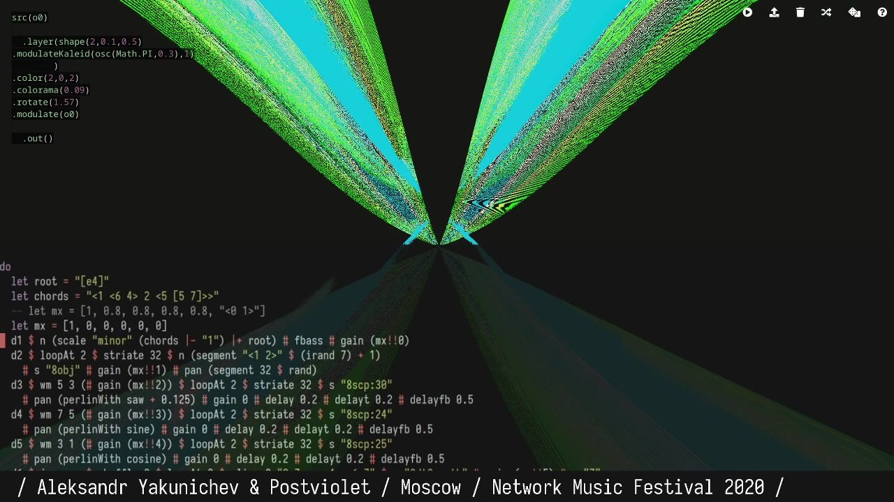
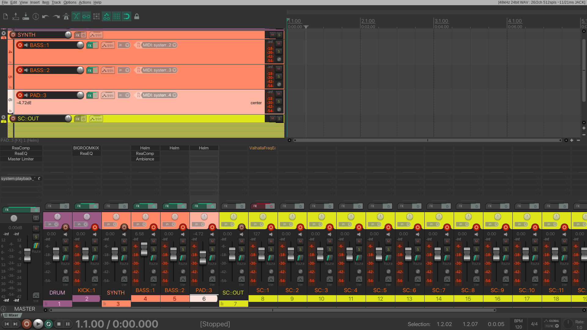
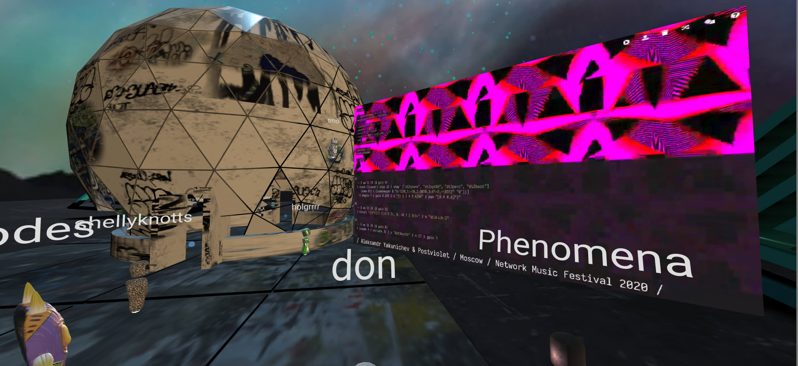
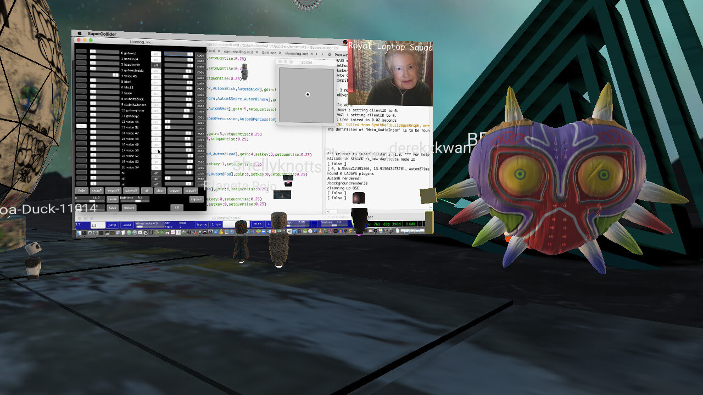
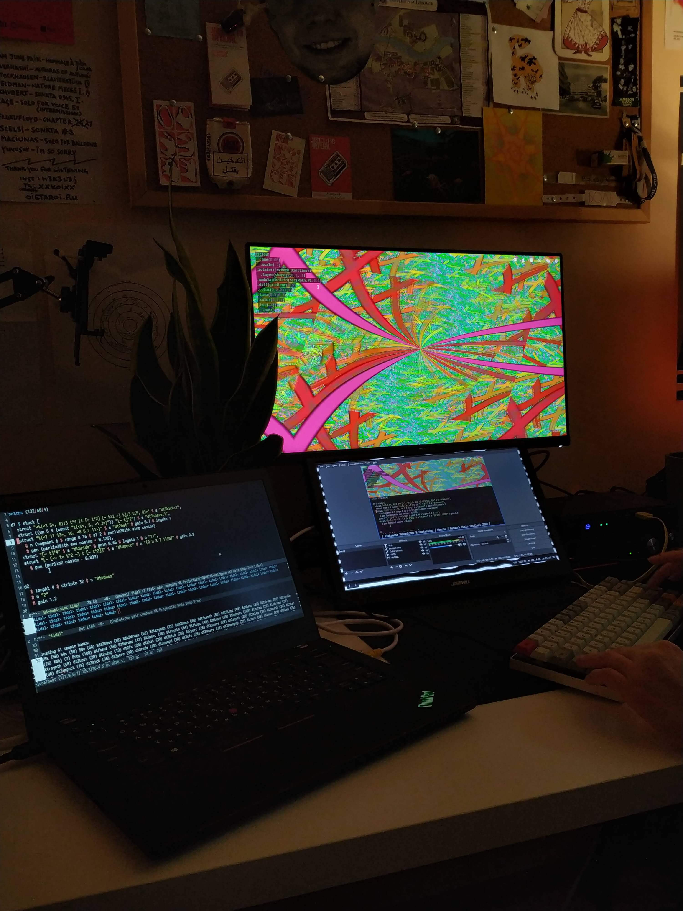

Repo for [Network Music Festival 2020](https://networkmusicfestival.org/algorave/ "NMF2020 Algorave Page") TidalCycles & Hydra performance by [Aleksandr Yakunichev](https://ya.codes/ "Aleksandr Yakunichev's Personal Site") & [Postviolet](http://www.violettapostnova.com/ "Postviolet's Personal Site")

## Videos

## Photos

## Music References
 - [xanopticon — these days](https://hymen-records.bandcamp.com/track/these-days)
 - [smog — Builders](https://failedunits.bandcamp.com/track/builders)
 - [Guadu — No Man Non Ta](https://kuduropsicadelico.bandcamp.com/track/no-man-non-ta)
 - [Giant Swan — Pan Head](https://giantswan.bandcamp.com/track/pan-head)
 - [N1L — fang mark semantics](https://n1lmusic.bandcamp.com/track/fang-mark-semantics)
 - [Sote — HSFT Side B](https://opaltapes.com/track/hsft-side-b)
 - [Vessel — Argo (For Maggie)](https://vesseluk.bandcamp.com/track/argo-for-maggie)
